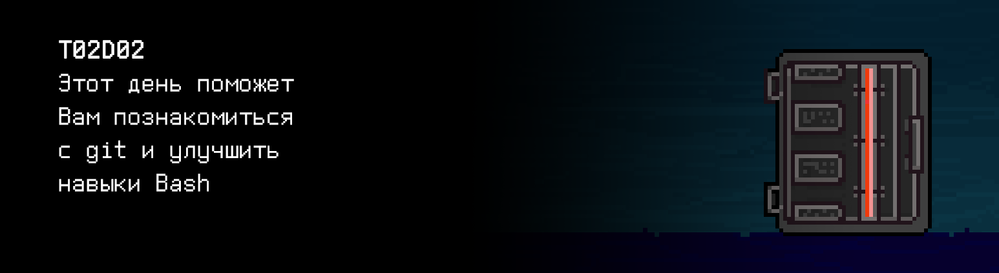

# T02D02

## Quest 1. Vim.

***== Получен Quest 1. Дополнить файл src/history_of_vim.txt свежими данными о Vim, используя Vim. Добавить сведения об обоих изменениях в журнал src/files.log в формате: путь к файлу — размер файла в байтах — дата и время — sha-сумма файла — алгоритм вычисления sha. ==***

## Quest 2. Script.

***== Получен Quest 2. Разработать скрипт src/edit.sh для замены подстрок в текстовых файлах. На вход он должен принимать путь до файла (относительно корневой директории), строку для замены и саму замену (в виде строки). Информация о каждом изменении файла должна заноситься в журнал src/files.log в формате, описанном в предыдущем квесте. Обратить внимание на обработку краевых ситуаций. ==***

## Quest 3. Log.

***== Получен Quest 3. Разработать скрипт src/log_analyzer.sh для анализа файла лога. На вход он должен принимать путь до файла (относительно корневой директории), в stdout выдавать 3 числа: общее количество записей, количество уникальных файлов и количество изменений, приведших к изменению hash файла. Предусмотреть обработку некорректных или отсутствующих файлов. Пример вывода для состояния журнала после Quest 1: 3 1 3 ==***

## Quest 4. Conflict.

***== Получен Quest 4. Исправить конфликты в файле src/history_of_vi.txt и запушить в репозиторий. Для исправления конфликтов можно воспользоваться как текстовым редактором, так и специализированными инструментами. ==***

## Quest 5. Gitlab.

***== Получен Quest 5. Подготовить краткий мануал по использованию GitLab в файле src/gitlab_manual.md в разметке Markdown. ==***
