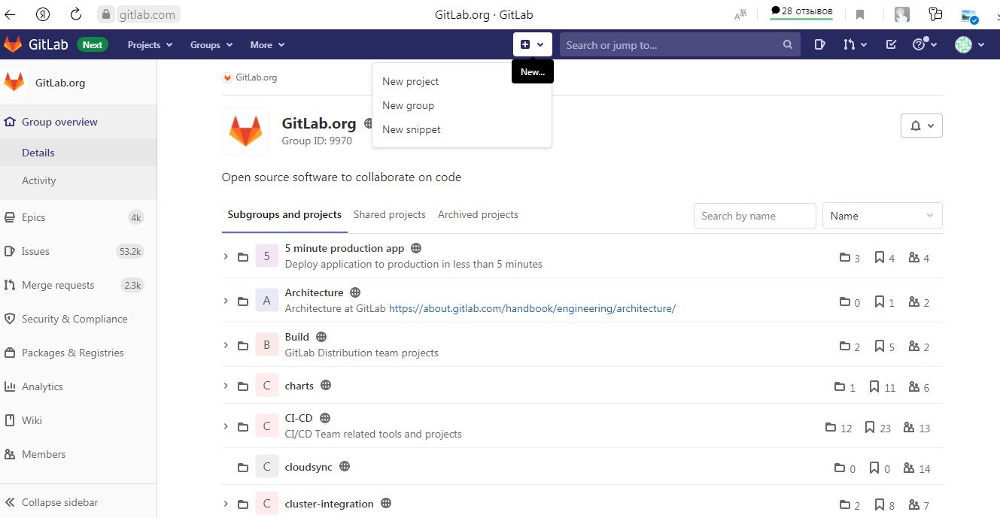
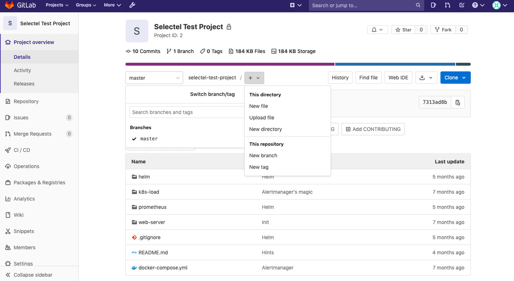
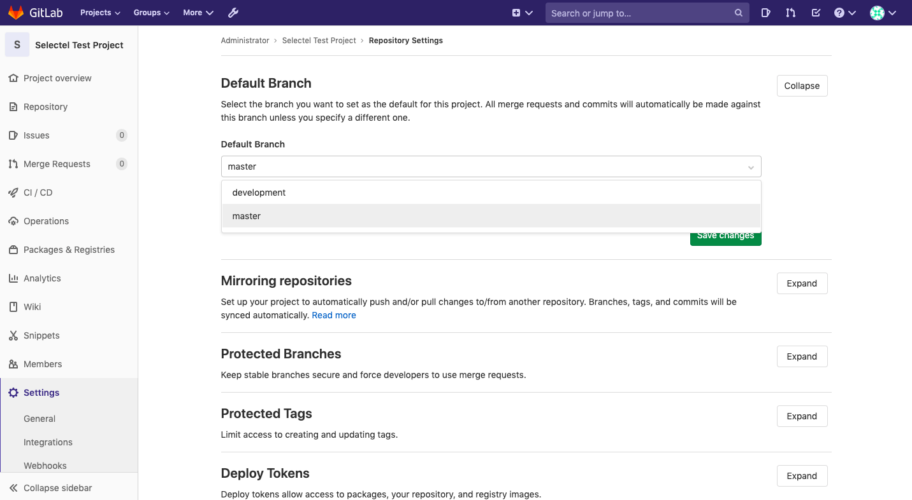
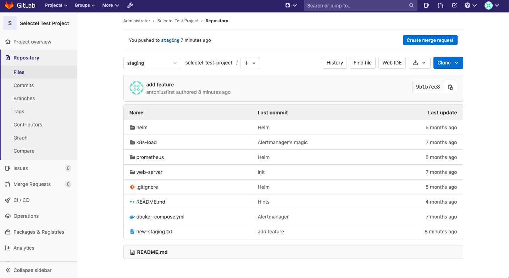
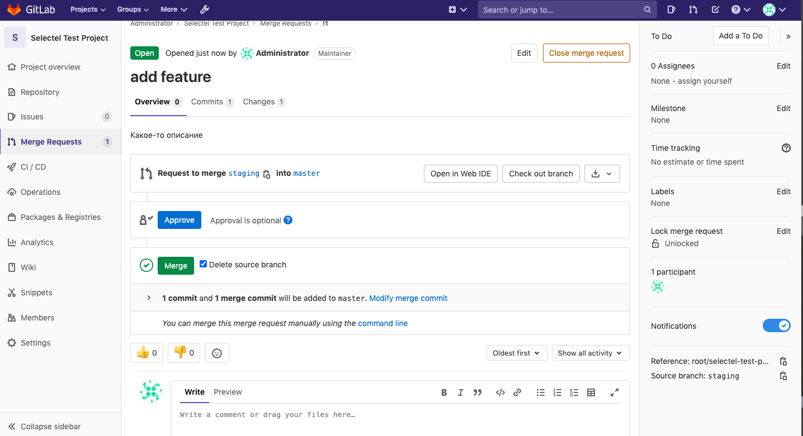
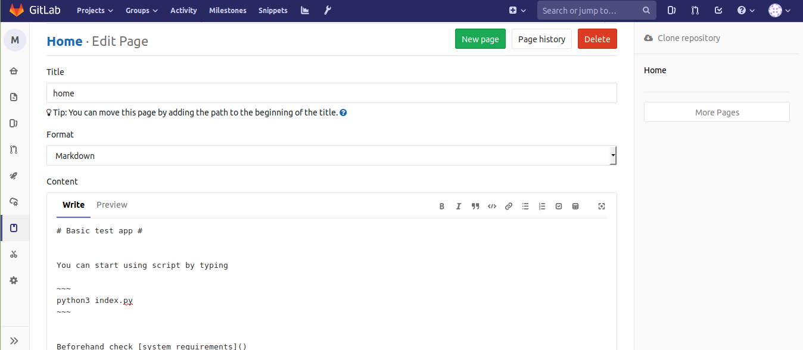

# GitLab manual

## Создание личного репозитория с нужным .gitignore и простым README.MD
Для создания нового проекта надо нажать на значок «+» по центру экрана и выбрать соответствующий пункт.

При создании надо указать имя, описание репозитория и определить уровень доступа: приватный, доступный всем зарегистрированным или публичный.
После указания всех данных и нажатия на кнопку «Create repo», репозиторий будет создан, а на его странице будет доступен стартовый набор действий.

## Создание веток develop и master
По умолчанию работа ведется в ветке master и все предыдущие действия мы выполняли именно в ней. Для реализации изменений и их отслеживание, разработчику важно иметь собственную ветку, код из которой в дальнейшем можно будет передать в master-ветку.
Чтобы создать новую ветку develop, достаточно в выпадающем меню рядом с символом + нажать на пункт меню New branch:

Новую ветку также можно создать в локальном репозитории Git и затем загрузить её в GitLab. В веб-интерфейсе появится соответствующая запись о новой ветке.

## Установка ветки develop по умолчанию
В меню Settings — Repository можно выбрать ветку, используемую по умолчанию. После выбора нужно нажать на кнопку Save changes.drfaa


## Создание issue на создание текущего мануала
Открываем раздел Issues в боковой панели управления. 
Затем нажимаем на кнопку New issue. 
Даем имя, а затем подробно описываем ее в разделе Description.
Затем назначаем ответственного в пункте Assignee и срок, в течение которого нужно найти решение найденной проблемы.
А потом нажимаем на кнопку Create issue.

## Создание ветки по issue
В центральном репозитории создаём ветку для решения задачи. Например, для задачи с номером 234 создаём ветку features/issue-234.

## Создание merge request по ветке в develop
Перейдем вmerge ветку и нажмем кнопку Create merge request:

Здесь нужно указать название слияния, его описание и, при необходимости, выбрать опцию уведомления заинтересованных пользователей. В нижней части этого экрана нужно нажать кнопку Submit merge request.

## Комментирование и принятие реквеста
На следующем экране можно опционально оставить комментарий и нажать Approve, а затем нажать Merge:


## Формирование стабильной версии в master с простановкой тега
Для получения стабильной версии в master сливаем изменения из develop в master. Для проставления тегов есть 2 способа: 
- теги с аннотациями, содержат сообщение, и имя и почту автора тега, как при коммите
- легковесные теги – просто указатель на определённый коммит, без всякой допонительной информации
Для добавления тега с аннотацией – используем -a или --annotate:
```git tag -a v1.0 -m "Init version"```
Для добавления легковесного тега – просто пропускаем -a и -m:
```git tag v1.0lw```

## Работа с wiki проекта
GitLab wiki — документация, которую можно вести для каждого проекта. Обычно это системные требования, описание пакетов и процесса установки.
После добавления проекта в меню слева доступен раздел Wiki. В нем модно добавить неограниченное количество страниц с текстовыми материалами. Wiki специфична для проекта.
Первой всегда добавляется главная страница Home.

Стандартным способом оформления является Markdown. Доступен режим Preview в котором видно как будет выглядеть текст.
Wiki могут существовать для проектов, находящихся в общем доступе и для приватных репозиториев. Подробную документацию всегда стоит вести, это позволит удобно работать с проектом всем, кому это требуется.