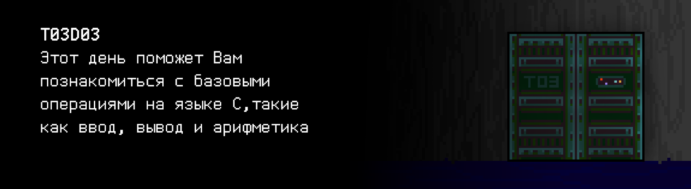

# T03D03

## Quest 1. Introducing.

***== Получен Quest 1. Создать программу src/hello.c, которая должна вывести на экран фразу "Hello, AI!", используя функции форматированного вывода из стандартной библиотеки. Здесь и далее все программы должны быть написаны на языке Си стандарта C11 с использованием компилятора gcc, флагов -Wall, -Werror, -Wextra и стилевой нормы Google C++ Style Guide, пушить в git необходимо только исходные файлы с кодом и файлы с данными (при необходимости) в директорию src, ветку develop. Разрешено подключать только заголовочный файл `<stdio.h>` ==***

>**Внимание:** С этого дня ваши решения будут проверяться автотестами. В данном и всех последующих квестах необходимо сторого придерживаться приведенных в таблице с примерами форматов ввода и вывода данных!

| Входные данные | Выходные данные |
| ------ | ------ |
|  | Hello, AI! |

## Quest 2. Not my name.

***== Получен Quest 2. Создать программу src/named_hello.c, которая 
на вход через stdin принимает целое число `name` и выводит на экран фразу 
"Hello, `name`!". Пушить в git необходимо только исходные файлы с 
кодом и файлы с данными (при необходимости) в директорию src, ветку develop. Здесь также действует ограничение: можно использовать только `<stdio.h>` ==***

| Входные данные | Выходные данные |
| ------ | ------ |
| 123 | Hello, 123! |

## Quest 3. Arithmetic test.

***== Получен Quest 3. Создать программу src/arithmetic.c, которая на вход через stdin принимает два целых числа и выводит на экран через пробел последовательно их сумму, разность, произведение и частное. Необходимо предусмотреть проверку на ввод только целых чисел. Ответ не должен заканчиваться пробелом. Предусмотреть обработку деления на ноль. В случае любой ошибки вывести n/a. Пушить в git необходимо только исходные файлы с кодом и файлы с данными (при необходимости) в директорию src, ветку develop. Разрешено подключать только заголовочный файл `<stdio.h>` ==***

| Входные данные | Выходные данные |
| ------ | ------ |
| 8 2 | 10 6 16 4 |
| 1 0 | 1 1 0 n/a |
| 3 2 | 5 1 6 1 |

## Quest 4. Who is Max?

***== Получен Quest 4. Создать программу src/max.c, которая на вход принимает два целых числа и выводит на экран наибольшее из них. Необходимо предусмотреть проверку на ввод только чисел — в случае ошибки вывести n/a. Поиск максимума оформить в виде отдельной функции. Пушить в git необходимо только исходные файлы с кодом и файлы с данными (при необходимости) в директорию src, ветку develop, об этом в будущем больше не будет напоминаться... Подключать можно только библиотеку `<stdio.h>` ==***

| Входные данные | Выходные данные |
| ------ | ------ |
| 3 2 | 3 |
| 12.3 10 | n/a |

## Quest 5. Complex calculations.

***== Получен Quest 5. Создать программу src/important_function.c, которая на вход принимает одно число `x` с плавающей точкой и выводит на экран результат подсчета функции (округленный до одной цифры после запятой). Необходимо предусмотреть проверку на ввод только чисел. В случае ошибки вывести n/a. В этом квесте помимо `<stdio.h>` вы можете использовать библиотеку `<math.h>` ==***

| Входные данные | Выходные данные |
| ------ | ------ |
| 1 | -2070.4 |

## Quest 6. Be careful with the floating.

***== Получен Quest 6. Изменить программу src/float_compare.c так, чтобы в результате вывелось "OK". Использовать сравнение с небольшой величиной (порядка 1E-6). Объявление переменных или констант не считается за дополнительное изменение кода. ==***

## Quest 7. Lock picking.

***== Получен Quest 7. Создать программу src/crack.c, которая на вход принимает два числа с плавающей точкой, а на выходе выдает “GOTCHA”, если координаты точки находятся внутри окружности, и “MISS” иначе. Предусмотреть ввод только чисел — в случае ошибки вывести n/a, использовать можно 
только `<stdio.h>` ==***

| Входные данные | Выходные данные |
| ------ | ------ |
| 1.5 1.5 | GOTCHA |

