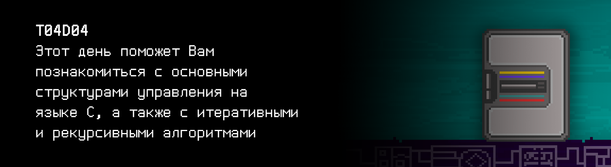
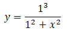
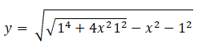
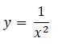

# T04D04

## Quest 1.  Basic control structures. Tom Kilburn.

***== Получен Quest 1. Создать программу src/1948.c, которая находит наибольший простой делитель заданного целого числа `a` и печатает его на экран. Необходимо выделить отдельную функцию для подсчёта этого значения. Использовать деление и операцию взятия остатка от деления нельзя. Однако, при необходимости деление можно реализовать при помощи вычитания. В случае ошибки вывести "n/a". ==***

| Входные данные | Выходные данные |
| ------ | ------ |
| 100 | 5 |
| -4 | 2 |

## Quest 2. Basic control structures. Some problems with symbols.

***== Получен Quest 2. Создать программу src/char_decode.c, которая принимает в качестве 
параметра командной строки режим работы (0 — кодирование или 1 — декодирование). 
Если выбран режим декодирования, то программа должна принимать из stdin разделенные 
пробелом двухсимвольные строки и выдавать в stdout декодированные символы, разделенные 
также пробелом. При кодировании выполняется обратная операция. Подзадачи кодирования и 
декодирования должны быть выделены в отдельные функции. Обратить внимание на ASCII таблицу. 
В случае ошибки выводить "n/a". Признаком окончания ввода служит символ переноса строки ==***

| Параметры командной строки | Входные данные | Выходные данные |
| ------ | ------ | ------ |
| 0 | W O R L D | 57 4F 52 4C 44 |
| 0 | WORLD | n/a |
| 1 | 48 45 4C 4C 4F | H E L L O |
| 1 | 48454C4C4F | n/a |

> НЕ ЗАБЫВАЙ! Все твои программы тестируются на стилевую норму. Инструкция по запуску 
> тестов все также лежит в папке `materials`

## Quest 3. Recursive.

***== Получен Quest 3. Создать программу src/quest3.c, которая рассчитывает и выводит на экран n-ое число Фибоначчи при помощи рекурсивного алгоритма. Сам поиск n-ого числа Фибоначчи должен быть выделен в отдельную функцию. Число вводится через стандартный поток ввода. В случае ошибки выводить "n/a". ==***

| Входные данные | Выходные данные |
| ------ | ------ |
| 21 | 10946 |

## Quest 4. Table.

Верзьера Аньези с единичным диаметром: 
 

Лемниската Бернулли с единичным интервалом в положительной полуплоскости: 
 

Квадратичная гипербола: 
 

***== Получен Quest 4. Создать программу src/door_functions.c, которая рассчитывает и выводит на экран таблицу из трех функций: Верзьера Аньези с единичным диаметром, Лемниската Бернулли с единичным интервалом в положительной полуплоскости (Y > 0) и квадратичная гипербола. В первом столбце перечисляются значения абсциссы от минус Пи до плюс Пи включительно, должно быть 42 замера на этом интервале. Второй, третий и четвертый столбцы описывают значения функций в точке. Заголовки таблицы не нужны. Все значения записываются с точностью до 7 знаков после запятой, необходимо использовать тип double для повышенной точности. Разделитель между столбцами — " | ". Всего должно быть ровно 42 записи в таблице. Результат работы программы нужно разместить в файле src/data/door_data.txt (запись в файл из программы реализовывать не нужно, моожно использовтаь перенаправление вывода). В случае, если функция не определена в какой-либо точке, в таблице должен быть знак "-". ==***

Результат:

-3.1415927 | 0.0919997 | - | 0.1013212 
-2.9883442 | 0.1007029 | - | 0.1119796 
...............e.r.r.o.r.......................................................

-1.3026116 | 0.3708103 | 0.3061966 | 0.5893457 
-1.1493632 | 0.4308421 | 0.4310262 | 0.7569818

....................................k.i.l.l..m.e..............................

## Bonus Quest 5*. Func.

***== Получен Quest 5. Дополнить программу src/door_functions.c так, чтобы она отрисовывала в терминале графики рассчитываемых функций при помощи символа "\*". Масштаб по оси абсцисс — 42 отсечки, масштаб оси ординат — 21. Расположение и поворот координатых осей не принципиальны. Написанный код сохранить в файл door_functions_print.c ==***
