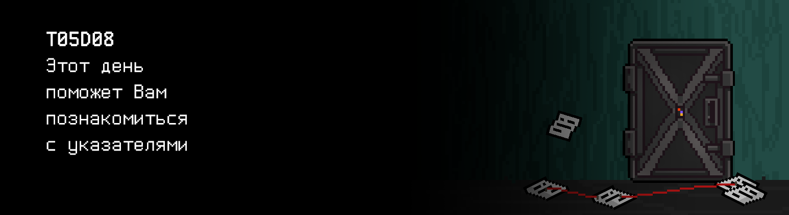

# T05D08

## Quest 1. Arguments and pointers.

***== Получен Quest 1. Внести исправления в программу src/maxmin.c таким образом, 
чтобы программа собиралась и корректно работала (находила max и min из 3х целых чисел и
выводила их на экран). Структуру программы не менять. В случае некорректного ввода 
необходимо выводить n/a.==***

| Входные данные | Выходные данные |
| ------ | ------ |
| 1 2 3 | 3 1 |

## Quest 2. Data I/O.

***== Получен Quest 2. Внести исправления в программу src/squaring.c таким образом, 
чтобы программа собиралась и корректно работала (принимала через stdin массив целых чисел, 
возводила их в квадрат и выводила в stdout). В случае некорректного ввода необходимо выводить n/a. 
Уменьшать декомпозицию нельзя - функции можно только добавлять при необходимости, но не убирать. ==***

| Входные данные | Выходные данные |
| ------ | ------ |
| 3 1 2 3 | 1 4 9 |

## Quest 3. Data metrics

***== Получен Quest 3. Добавить реализации необходимых функций в программу src/stat.c таким образом, 
чтобы программа собиралась и корректно работала (принимала через stdin массив целых чисел, выводила 
бы его, вычисляла и выводила на новой строке набор статистических метрик - экстремумы (max и min), математическое 
ожидание и дисперсию, считая, что мы имеем дело с дискретным равномерным распределением). В случае некорректного ввода необходимо выводить n/a. Уменьшать декомпозицию 
нельзя - функции можно только добавлять при необходимости, но не убирать. Придерживаться предложенной 
структуры программы. Числа с плавающей запятой выводить с точностью 6 знаков после запятой. ==***

| Входные данные | Выходные данные |
| ------ | ------ |
| 4 1 2 3 4 | 1 2 3 4 4 1 2.500000 1.250000 |

## Quest 4. Search.

***== Получен Quest 4. Реализовать программу src/search.c в соответствии с комментарием. Программа должна принимать через stdin массив целых чисел и находить в нем первое вхождение числа, удовлетворяющего следующим требованиям: быть четным, быть большим или равным математическому ожиданию, подчиняться правилу трех сигм и не равняться 0. Найденное число должно быть выведено в stdout. Если такого числа нет, то программа должна выдавать 0. Максимальное количество введенных чисел равно 30. В случае некорректного ввода необходимо выводить n/a. При разработке необходимо придерживаться идей декомпозии из предыдущих квестов, приветствуется переиспользование уже разработанных функций. Функции должны быть компактными и простыми, и занимать не более 20-30 строк кода.==***

| Входные данные | Выходные данные |
| ------ | ------ |
| 4 1 2 3 4 | 4 |
