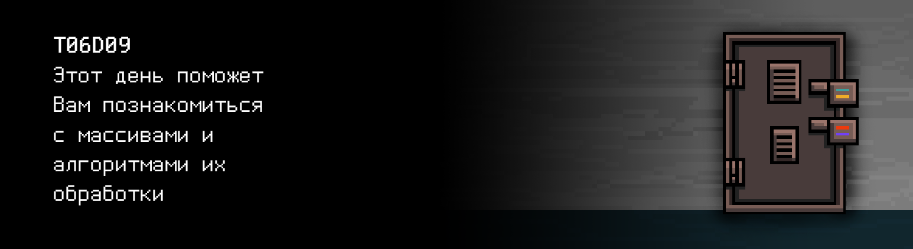

# T06D09

>**Внимание!** В квестах этого дня запрещено использовать динамическую память

## Quest 1. Sort & memory.

***== Получен Quest 1. Создать программу src/sort.c, ожидающую на вход в stdin массив длиной 10 из целых чисел и выводящую этот же массив, но уже отсортированный по возрастанию. Необходимо выделить функции чтения, сортировки и вывода массива отдельно. Алгоритм сортировки можно использовать любой. Использовать stdlib.h нельзя. Передача массива в функцию только по указателю. В случае ошибки выводить "n/a". ==***

| Входные данные | Выходные данные |
| ------ | ------ |
| 4 3 9 0 1 2 100 2 7 -1 | -1 0 1 2 2 3 4 7 9 100 |

> НЕ ЗАБЫВАЙ! Все твои программы тестируются на стилевую норму и утечки памяти. Инструкция по запуску 
> тестов все также лежит в папке `materials`

## Bonus Quest 2*. Sort.

***== Получен Quest 2. Создать программу src/fast_sort.c, которая сортирует по возрастанию массив из 10 элементов двумя разными алгоритмами сортировки с теоретическими оценками вычислительных сложностей не выше nlog(n) (например, быстрая и пирамидальная сортировки). В stdout в первой строке вывести отсортированный массив первым алгоритмом, во второй соответственно вторым алгоритмом. Использовать stdlib.h и сторонние библиотеки нельзя. Руководствоваться принципами структурного программирования. Передача массива в функцию только по указателю. В случае ошибки выводить "n/a". ==***

| Входные данные | Выходные данные |
| ------ | ------ |
| 4 3 9 0 1 2 100 2 7 -1 | -1 0 1 2 2 3 4 7 9 100 -1 0 1 2 2 3 4 7 9 100 |

## Quest 3. Several arrays.

***== Получен Quest 3. Изменить программу src/key9part1.c так, чтобы она принимала на вход длину массива и массив целых чисел. В качестве выхода она должна вывести в stdout сумму четных элементов массива и новый сформированный массив из элементов старого, на которые делится нацело подсчитанная ранее сумма. Уменьшать декомпозицию нельзя - функции можно только добавлять при необходимости, но не убирать. Использовать stdlib.h нельзя. Передача массива в функцию только по указателю. Максимальный размер входного массива - 10. В случае ошибки или отсутствии четных элементов выводить "n/a". ==***

| Входные данные | Выходные данные |
| ------ | ------ |
| 10 4 3 9 0 1 2 0 2 7 -1 | 8 4 1 2 2 -1 |

## Quest 4. Cyclic shift.

***== Получен Quest 4. Создать программу src/cycle_shift.c, ожидающую на вход число `n`, массив `A` из `n` целых чисел и число `c`, на которое все элементы массива должны сдвинутся влево циклично. При этом, при отрицательном значении `c` сдвиг должен произойти вправо по массиву. В качестве вывода ожидается измененный массив. Необходимо придерживаться предлагаемой декомпозиции, как и в прошлых квестах.  Использовать stdlib.h нельзя. Передача массива в функцию только по указателю. Максимальный размер входного массива - 10. В случае ошибки выводить "n/a". ==***

| Входные данные | Выходные данные |
| ------ | ------ |
| 10 4 3 9 0 1 2 0 2 7 -1 2 | 9 0 1 2 0 2 7 -1 4 3 |

## Quest 5. Arbitrary-precision arithmetic.

***== Получен Quest 5. Изменить программу src/key9part2.c так, чтобы она вернула результат сложения и разности двух очень больших чисел, переданных программе на вход в виде массивов. Максимальная длина числа - 100 элементов типа int. Вводимые целые числа представляют собой десятичные цифры. В случае если вычитаемое больше уменьшаемого, в разности выводится "n/a". Необходимо придерживаться декомпозиции, как и в прошлых квестах. Использовать stdlib.h нельзя. Передача массива в функцию только по указателю. В случае ошибки выводить "n/a". ==***

| Входные данные | Выходные данные |
| ------ | ------ |
| 1 9 4 4 6 7 4 4 0 7 3 7 0 9 5 5 1 6 1 2 9 | 1 9 4 4 6 7 4 4 0 7 3 7 0 9 5 5 1 9 0 1 9 4 4 6 7 4 4 0 7 3 7 0 9 5 5 1 3 2 |
| 0 1 0 0 0 1 | 1 1 9 |

