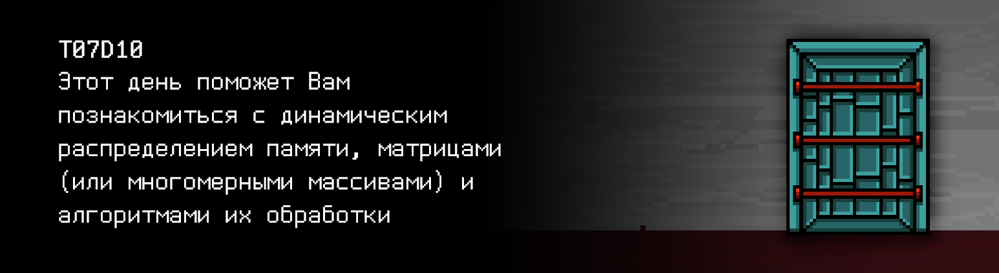

# T07D10 

## Quest 1. Allocate memory first...

***== Получен Quest 1. Изменить программу src/sort.c из прошлой комнаты так, чтобы память под 
массив выделялась динамически (при помощи функций malloc или calloc). Длина массива `n` указывается 
в stdin перед вводом самого массива. В случае любой ошибки выводить "n/a". В конце вывода не должно быть
символа переноса строки ==***

| Входные данные | Выходные данные |
| ------ | ------ |
| 10 4 3 9 0 1 2 100 2 7 -1 | -1 0 1 2 2 3 4 7 9 100 |

## Quest 2. Try not to leak then.

***== Получен Quest 2. Создать программу src/sort_no_leak.c, в которой необходимо избавиться от 
утечки памяти в программе src/sort.c. Если утечки не было с самого начала, то просто пожать плечами 
и скопировать src/sort.c в src/sort_no_leak.c. ==***

| Входные данные | Выходные данные |
| ------ | ------ |
| 10 4 3 9 0 1 2 100 2 7 -1 | -1 0 1 2 2 3 4 7 9 100 |

## Quest 3. The 1+3 ways.

***== Получен Quest 3. Добавить программу src/matrix.c, которая вводит и выводит целочисленные матрицы. 
Выделение памяти под матрицу необходимо реализовать в 4 видах: статический и 3 динамических. При статическом 
выделении максимальный размер матрицы не превышает 100 x 100. Для выбора способа выделения памяти в 
программе нужно реализовать меню с подпунктами 1-4. Размер матрицы (сперва количество строк, затем столбцов) 
принимается через два числа в stdin непосредственно до ее ввода. Также, необходимо чистить всю выделенную память. 
За подсказкой обратиться к папке materials. Обратите внимание на вывод матрицы: в конце каждой строчки 
не должно быть лишних пробелов. После последней строчки не должно быть символа переноса на новую строку.
В случае любой ошибки выводить "n/a" ==***

| Входные данные | Выходные данные |
| ------ | ------ |
| 2 2 2 4 3 9 0 | 4 3 9 0 |

## Quest 4. MinMax search.

***== Получен Quest 4. Добавить программу src/matrix_extended.c, которая расширяет функционал 
программы src/matrix.c. Необходимо вычислить максимальные элементы матрицы в каждой ее строке и 
минимальные элементы в каждом ее столбце и вывести эти значения в конце после вывода матрицы в виде 
двух массивов (массив максимальных элементов в каждой строке и массив минимальных 
элементов в каждом столбце). Также обратите внимание: никаких символов переноса после последней строки(!)==***

| Входные данные | Выходные данные |
| ------ | ------ |
| 2 3 3 4 3 1 9 0 55 -4 7 111 | 4 3 1 9 0 55 -4 7 111 4 55 111 -4 0 1 |

## Quest 5. Making a picture.

***== Получен Quest 5. Изменить программу src/picture.c так, чтобы она отрисовывала картинку со [стены комнаты](#level-2-room-3) в терминале при помощи заготовленных в коде массивов и матриц. Статические массивы и матрицы менять нельзя. ==***

## Quest 6. Another sort.

***== Получен Quest 6. Добавить программу src/matrix_sort.c, которая сортирует заданную матрицу так, 
чтобы сначала шли строки с минимальной суммой элементов, а затем с максимальной. На вход подаются 
числа N и M - размерности матрицы и NxM чисел - элементы матрицы. Память под матрицу должна выделяться 
динамически одним из 3х способов. И, соответственно, освобождаться в конце работы программы. 
В случае любой ошибки выводить "n/a". ==***

| Input | Output |
| ------ | ------ |
| 1 3 3 4 3 1 9 0 55 -4 7 -10 | -4 7 -10 4 3 1 9 0 55 |

## Quest 7. Matrix arithmetic.

***== Получен Quest 7. Добавить программу src/matrix_arithmetic.c, которая производит одну из трех операций: 
1 - суммирование двух матриц, 2 - умножение или 3 - транспонирование. Перед вводом размеров и матриц 
вводится код соответствующей операции. Матрицы, как и ранее, целочисленные. В случае любой ошибки выводить "n/a". ==***

| Входные данные | Выходные данные |
| ------ | ------ |
| 1 2 2 4 3 9 0 2 2 1 1 2 2 | 5 4 11 2 |
| 2 2 3 4 3 1 9 0 2 3 1 1 2 3 | 13 15 |
| 3 2 2 4 3 9 0 | 4 9 3 0 |

## Quest 8. The Magic Key.

***== Получен Quest 8. Решить приведенную задачу и сохранить результат расчетов в src/key10.txt. ==***
