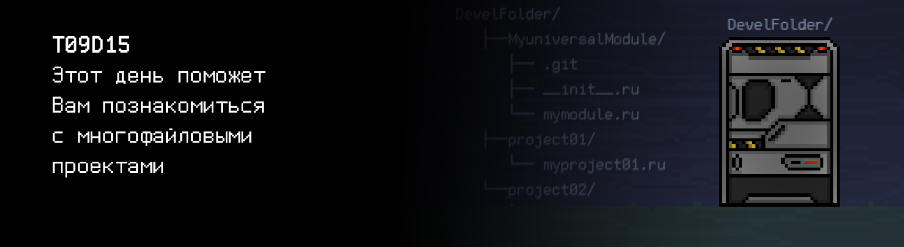

# T09D15

## Quest 1. Modules.
    
***== Получен Quest 1. Доработать модуль src/data_module таким образом, чтобы src/data_module/data_module_entry.c запускался и работал корректно. Обратить внимание на директорию data_libs. Максимально переиспользовать имеющиеся файлы и функции, применяя соответствующие директивы препроцессора. ==***

## Quest 2. Modules II.

***== Получен Quest 2. Доработать модуль src/yet_another_decision_module таким образом, чтобы src/yet_another_decision_module/yet_another_decision_module_entry.c запускался и работал корректно. Обратить внимание на директорию data_libs. Максимально переиспользовать имеющиеся файлы и функции, применяя соответствующие директивы препроцессора.  ==***

## Quest 3. Makefile.

***== Получен Quest 3. Доработать модуль src/main_executable_module таким образом, чтобы src/main_executable_module/main_executable_module.c запускался и работал корректно. Разработать Makefile для сборки решения и поместить его в директорию src/main_executable_module. В Makefile предусмотреть стандартные цели: clean, all, rebuild. При разработке Makefile руководствоваться стандартными решениями, применяемыми при разработке программ на языке Си. Скомпилированный файл должен располагаться в папке build, в корне репозитория и иметь имя Quest_3. Сам результат компиляции загружать в репозиторий не нужно. ==***

## Bonus Quest 4*. Macro.

***== Получен Quest 4. Добавить в папку src/data_libs реализацию data_io_macro.h с помощью параметризованных многострочных макроопределений. Реализация должна работать с массивами любых типов. Доработать main_executable_module.c таким образом, чтобы была возможность конфигурировать с помощью макроса подключение header-файла модуля io (стандартная реализация data_io.h или data_io_macro.h). Добавить в Makefile цель build_with_macro для сборки main_executable_module с data_io_macro.h, подредактировав, при необходимости, цель all (для работы с  data_io.h). Скомпилированный файл должен располагаться в папке build, в корне репозитория и иметь имя Quest_4. Сам результат компиляции загружать в репозиторий не нужно. ==***

## Quest 5. Static Lib.

***== Получен Quest 5. Добавить в Makefile цель data_stat.a, собирающую модуль data_stat как статическую библиотеку data_stat.a. Добавить в Makefile цель build_with_static, собирающую main_executable_module с подключением модуля data_stat как статической библиотеки. Загружать data_stat.a в репозиторий нельзя, как и любой другой результат компиляции и сборки (объектный файл, статическая или динамическая библиотека, исполняемый файл). Скомпилированный файл должен располагаться в папке build, в корне репозитория и иметь имя Quest_5. ==***

## Quest 6. Dynamic Lib.

***== Получен Quest 6. Добавить в Makefile цель data_process.so, собирающую модуль data_process как динамическую библиотеку data_process.so. Добавить в Makefile цель build_with_dynamic, собирающую main_executable_module с подключением модуля data_process как динамической библиотеки. Внести необходимые изменения в код main_executable_module, конфигурировав использование динамической библиотеки с помощью макросов. Загружать data_process.so в репозиторий нельзя, как и любой другой результат сборки. Скомпилированный файл должен располагаться в папке build, в корне репозитория и иметь имя Quest_6. ==***
