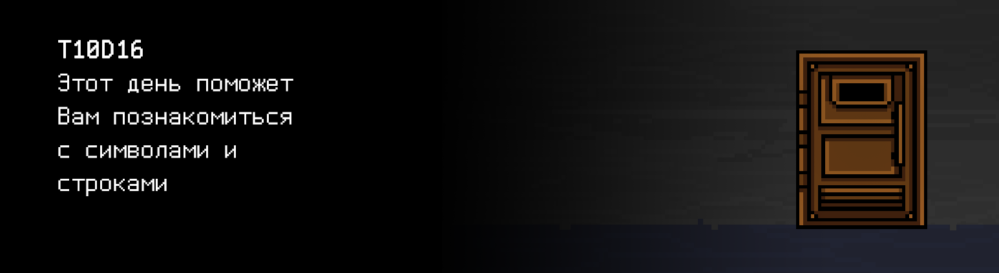

# T10D16

## Quest 1. Strlen.

***== Получен Quest 1. Создать файлы src/s21_string.h и src/s21_string.c и добавить в них объявление и определение функции s21_strlen. Создать тестовую программу src/s21_string_test.c, куда добавить функцию s21_strlen_test для проверки функции s21_strlen на наборе тестовых данных (от 3-х): нормальные значения, ненормальные значения, краевые значения и т.д. По каждому тесту в stdout выводится вход, выход и результат теста (SUCCESS/FAIL). В main разместить запуск этой функции. При разработке функции s21_strlen использовать только средства языка, использовать string.h и другие библиотеки нельзя. Сборку программы осуществлять при помощи Makefile. Имя стадии сборки - strlen_tests. Исполняемый файл должен храниться в корне в папке build с именем Quest_1. ==***

> Разрешено пользоваться только следующими стандартными библиотеками: stdlib.h, stdio.h

## Quest 2. Strcmp.

***== Получен Quest 2.  Добавить объявление и определение функции s21_strcmp в файлы src/s21_string.h и src/s21_string.c. Добавить функцию s21_strcmp_test в файл src/s21_string_test.c для проверки функции s21_strcmp на наборе тестовых данных (от 3-х): нормальные значения, ненормальные значения, краевые значения и т.д. По каждому тесту в stdout выводится вход, выход и результат теста (SUCCESS/FAIL). В main добавить запуск этой функции. При разработке функции s21_strcmp использовать только средства языка, использовать string.h и другие библиотеки нельзя. Сборку программы осуществлять при помощи Makefile. Имя стадии сборки - strcmp_tests. Исполняемый файл должен храниться в корне в папке build с именем Quest_2. ==***

> Разрешено пользоваться только следующими стандартными библиотеками: stdlib.h, stdio.h

## Quest 3. Strcpy.

***== Получен Quest 3.  Добавить объявление и определение функции s21_strcpy в файлы src/s21_string.h и src/s21_string.c. Добавить функцию s21_strcpy_test в файл src/s21_string_test.c для проверки функции s21_strcpy на наборе тестовых данных (от 3-х): нормальные значения, ненормальные значения, краевые значения и т.д. По каждому тесту в stdout выводится вход, выход и результат теста (SUCCESS/FAIL). В main добавить запуск этой функции. При разработке функции s21_strcpy использовать только средства языка, использовать string.h и другие библиотеки нельзя. Сборку программы осуществлять при помощи Makefile. Имя стадии сборки - strcpy_tests. Исполняемый файл должен храниться в корне в папке build с именем Quest_3. ==***

> Разрешено пользоваться только следующими стандартными библиотеками: stdlib.h, stdio.h

## Quest 4. Strcat.

***== Получен Quest 4. Добавить объявление и определение функции s21_strcat в файлы src/s21_string.h и src/s21_string.c. Добавить функцию s21_strcat_test в файл src/s21_string_test.c для проверки функции s21_strcat на наборе тестовых данных (от 3-х): нормальные значения, ненормальные значения, краевые значения и т.д. По каждому тесту в stdout выводится вход, выход и результат теста (SUCCESS/FAIL). В main добавить запуск этой функции. При разработке функции s21_strcat использовать только средства языка, использовать string.h и другие библиотеки нельзя. Сборку программы осуществлять при помощи Makefile. Имя стадии сборки - strcat_tests. Исполняемый файл должен храниться в корне в папке build с именем Quest_4. ==***

> Разрешено пользоваться только следующими стандартными библиотеками: stdlib.h, stdio.h

## Quest 5. Strchr.

***== Получен Quest 5. Добавить объявление и определение функции s21_strchr в файлы src/s21_string.h и src/s21_string.c. Добавить функцию s21_strchr_test в файл src/s21_string_test.c для проверки функции s21_strchr на наборе тестовых данных (от 3-х): нормальные значения, ненормальные значения, краевые значения и т.д. По каждому тесту в stdout выводится вход, выход и результат теста (SUCCESS/FAIL). В main добавить запуск этой функции. При разработке функции s21_strchr использовать только средства языка, использовать string.h и другие библиотеки нельзя. Сборку программы осуществлять при помощи Makefile. Имя стадии сборки - strchr_tests. Исполняемый файл должен храниться в корне в папке build с именем Quest_5. ==***

> Разрешено пользоваться только следующими стандартными библиотеками: stdlib.h, stdio.h

## Quest 6. Strstr.
    
***== Получен Quest 6.  Добавить объявление и определение функции s21_strstr в файлы src/s21_string.h и src/s21_string.c. Добавить функцию s21_strstr_test в файл src/s21_string_test.c для проверки функции s21_strstr на наборе тестовых данных (от 3-х): нормальные значения, ненормальные значения, краевые значения и т.д. По каждому тесту в stdout выводится вход, выход и результат теста (SUCCESS/FAIL). В main добавить запуск этой функции. При разработке функции s21_strstr использовать только средства языка, использовать string.h и другие библиотеки нельзя. Сборку программы осуществлять при помощи Makefile. Имя стадии сборки - strstr_tests. Исполняемый файл должен храниться в корне в папке build с именем Quest_6. ==***

> Разрешено пользоваться только следующими стандартными библиотеками: stdlib.h, stdio.h

## Quest 7. Strtok.

***== Получен Quest 7. Добавить объявление и определение функции s21_strtok в файлы src/s21_string.h и src/s21_string.c. Добавить функцию s21_strtok_test в файл src/s21_string_test.c для проверки функции s21_strtok на наборе тестовых данных (от 3-х): нормальные значения, ненормальные значения, краевые значения и т.д. По каждому тесту в stdout выводится вход, выход и результат теста (SUCCESS/FAIL). В main добавить запуск этой функции. При разработке функции s21_strtok использовать только средства языка, использовать string.h и другие библиотеки нельзя. Сборку программы осуществлять при помощи Makefile. Имя стадии сборки - strtok_tests. Исполняемый файл должен храниться в корне в папке build с именем Quest_7. ==***

> Разрешено пользоваться только следующими стандартными библиотеками: stdlib.h, stdio.h

## Bonus Quest 8*. Width.

***== Получен Quest 8. Создать программу src/text_processor.c, которая при запуске с ключом командной строки -w принимает на вход в stdin число (ширину строки) и текст до 100 символов, оканчивающийся символом переноса строки. При любых других ключах программа должна выводить "n/a". При запуске с ключом -w, программа форматирует входной текст по ширине и выводит в stdout, имитируя поведение текстового процессора. Текст должен быть разбит на несколько строк, каждая из которых состоит из указанного количества символов. Строки не могут начинаться с пробела и не могут заканчиваться пробелом, последняя строка не должна оканчиваться знаком переноса строки. Слово может быть разбито для перехода на новую строку через символ '-' только, если целиком не помещается на одной строке. Во всех других случаях оно должно оставаться целым. Слова в строке размещать равномерно, заполняя пространство между ними пробелами. Использовать string.h нельзя. Имя стадии сборки - text_processor. Исполняемый файл должен храниться в корне в папке build с именем Quest_8. ==***

| Параметры командной строки | Входные данные | Выходные данные |
| ------ | ------ | ------ |
| -w | 10 hello how are you | hello how are you |
| -w | 5 ab abcd ab abcd ab abcdefgh | ab abcd ab abcd ab a- bcde- fgh |

> Разрешено пользоваться только следующими стандартными библиотеками: stdlib.h, stdio.h
