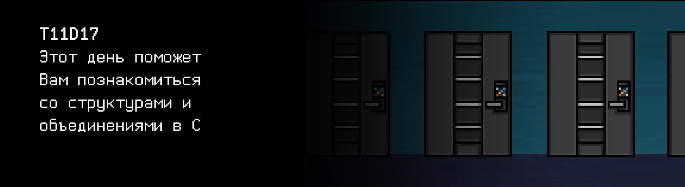

# T11D17

## Quest 1. The Doors. 

***== Получен Quest 1. Создать структуру дверей в src/door_struct.h. Сама структура состоит из целочисленного 
id двери и целочисленного status'а (0 - закрыто, 1 - открыто). Исправить программу src/dmanager_module.c так, 
чтобы она отсортировала проинициализированный массив дверей по возрастанию id дверей любым алгоритмом и вывела его в 
формате: "id двери, статус двери". Помимо этого для всех дверей проставить статус "закрыта". Изменять 
функцию инициализации дверей нельзя. Придерживаться структурного подхода. Программа должна собираться при 
помощи Makefile. Имя стадии - door_struct. Исполняемый файл должен располагаться в корне репозитория в папке 
build и иметь имя Quest_1. Решение будет проверяться на утечки памяти и на стилевую норму, инструкции 
как обычно - в `materials` ==***

0, 0 
1, 0 
2, 0 
3, 0 
4, 0 
5, 0 
6, 0 
7, 0 
8, 0 
9, 0 
10, 0 
11, 0 
12, 0 
13, 0 
14, 0 

## Quest 2. Linked List.

***== Получен Quest 2. Разработать программу src/list.c, в которой содержатся реализации функций по работе 
с односвязным списком дверей (`struct node* init(struct door* door)` - инициализация структуры односвязного списка на базе переданной `struct door`, `struct node* add_door(struct node* elem, struct door* door)` - вставка нового элемента `struct door` в односвязный список после переданного узла `elem`, `struct node* find_door(int door_id, struct node* root)` - поиск двери в списке по её id, `struct node* remove_door(struct node* elem, struct node* root)` - удаление элемента списка, `void destroy(struct node* root)` - освобождение памяти, занимаемой структурой списка). Объявления этих функций и структуру односвязного списка вынести в файл src/list.h. Написать модульные тесты для проверки работы функций add_door 
и remove_door одногосвязного списка в src/list_test.c. Функции методов должны возвращать SUCCESS в случае успешного прохождения 
теста и FAIL - в случае ошибки. Тесты должны собираться при помощи Makefile. Имя стадии - list_test. 
Исполняемый файл должен располагаться в корне репозитория в папке build и иметь имя Quest_2 
Обратите внимание: этот квест будет тестироваться утилитой `cppcheck`==***

## Quest 3. Stack for key. 

***== Получен Quest 3. Разработать программу src/stack.c, в которой содержатся реализации функций по работе 
с динамическим стеком (init, push, pop, destroy). Объявления функций и структуры динамического стека, 
хранящего целые числа, вынести в src/stack.h. Написать модульные тесты для проверки работы функций push 
и pop стека в src/stack_test.c. Функции методов должны возвращать SUCCESS в случае успешного прохождения 
теста и FAIL - в случае ошибки. Тесты должны собираться при помощи Makefile. Имя стадии - stack_test. 
Исполняемый файл должен располагаться в корне репозитория в папке build и иметь имя Quest_3. 
Обратите внимание: этот квест будет тестироваться утилитой `cppcheck` ==***
