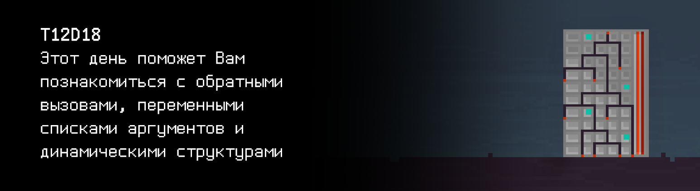

# T12D18

## Quest 1. Print Module.

***== Получен Quest 1. Дописать в файле src/print_module.c функцию print_log таким образом, чтобы она при помощи переданной ей в параметрах функции выводила сообщение следующего типа: "[LOG] текущее_время сообщение". Текущее время должно быть в формате ЧЧ:ММ:СС. По необходимости изменить файл src/main_module_entry_point.c. Сборка программы должна осуществляться при помощи Makefile. Имя стадии - print_module, исполняемого файла - Quest_1. ==***

## Quest 2. Checking Module.

***== Получен Quest 2. Дописать в файле src/documentation_module.c функцию check_available_documentation_module так, чтобы она применяла к каждому переданному ей документу в параметрах функцию валидации, также переданную в параметрах. Результатом работы программы должен являться массив доступности документов, представляющий из себя массив целых чисел (0 - документ недоступен, 1 - документ доступен). Изменить файл src/main_module_entry_point.c так, чтобы он реализовывал человекочитаемый вывод доступности документов при помощи полученного массива (формата: [название документа : (un)available]). Для проверяемых документов установите модификатор размера поля вывода в 15 единиц. Обратить внимание, что функция принимает произвольное число аргументов. Сборка программы должна осуществляться при помощи Makefile. Имя стадии - documentation_module, исполняемого файла - Quest_2. ==***

## Quest 3. BST.

***== Получен Quest 3. Создать программу src/bst.c, в которой реализовать функцию создания узла дерева бинарного поиска bstree_create_node. В src/bst.h расположить описание типа узла дерева. При помощи модульного тестирования проверить разработанную функцию в src/bst_create_test.c (минимум два входных значения с выводом что создалось). Сборка программы должна осуществляться при помощи Makefile. Имя стадии - bst_create_test, исполняемого файла - Quest_3. ==***

## Quest 4. Growing tree.

***== Получен Quest 4. Дополнить программу src/bst.c путем реализации функции вставки узла дерева бинарного поиска bstree_insert. При помощи модульного тестирования проверить разработанную функцию в src/bst_insert_test.c (минимум два различых набора входных значений с выводом места вставки листа дерева). Предусмотреть реализацию функции компаратора. Сборка программы должна осуществляться при помощи Makefile. Имя стадии - bst_insert_test, исполняемого файла - Quest_4. ==***

## Quest 5. Three styles of traversing.

***== Получен Quest 5. Дополнить программу src/bst.c путем реализации функций обхода дерева бинарного поиска bstree_apply_infix, bstree_apply_prefix, bstree_apply_postfix. При помощи модульного тестирования проверить написанные функции в src/bst_traverse_test.c (взять наборы входных данных из предыдущего теста и оформить вывод на экран деревьев тремя разными способами). Подготовить реализацию функции applyf как функции, печатающей значение узла в терминал. Сборка программы должна осуществляться при помощи Makefile. Имя стадии - bst_traverse_test, исполняемого файла - Quest_5. ==***
