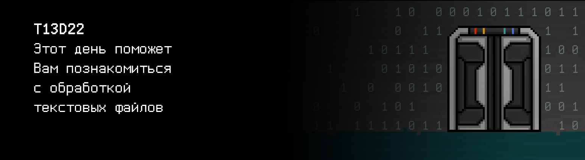

# T13D22

## Quest 1. Open and read.

***== Получен Quest 1. Создать программу src/cipher.c. Добавить в нее консольное меню и реализовать первый
его пункт - указание пути к текстовому файлу через stdin для его открытия, чтения и вывода в консоль.
Если файл
пуст или не существует, или произошла какая-либо другая ошибка, выведите "n/a". Если на вход подается -1, должен происходить выход из программы. После выполнения каждого пункта меню, кроме -1, должен быть перенос строки. Сборка проекта должна осуществляться при помощи Makefile.
Имя стадии - cipher. Имя исполняемого файла - cipher.  Исполняемый файл должен располагаться в корне репозитория
в папке build. ==***

| Входные данные | Выходные данные | Файл |
| ------ | ------ | ------|
| 1 text.txt -1 | Aloha!  | Aloha! |
| 1 abc.txt 1 abc.txt -1 | Hihi_haha  Hihi_haha   | Hihi_haha`\n` |
| 1 doesnt_exist.t_x_t 1 love.txt -1 | n/a i_love_sh21  | i_love_sh21 |

> Перед отправкой задания, убедитесь, что никакие лишние записи на экране не выводятся. Должен быть только ответ на задачу

## Quest 2. Write your story.

***== Получен Quest 2. Дополнить программу src/cipher.c. Добавить в меню пункт 2 - прием произвольной строки текста из консоли и запись ее в конец файла, загруженного в пункте 1. Содержимое файла вывести в консоль. Если файл пуст или не существует, или произошла какая-либо другая ошибка, выведите "n/a". Если на вход подается -1, должен происходить выход из программы.  После выполнения каждого пункта меню, кроме -1, должен быть перенос строки. Сборка проекта должна осуществляться при помощи Makefile. Имя стадии - cipher. Имя исполняемого файла - cipher. Исполняемый файл должен располагаться в корне репозитория
в папке build. ==***

| Входные данные | Выходные данные | Файл |
| ------ | ------ | ----- |
| 1 test.txt 2 Bek the great -1 | I_love  I_love Bek the great  | I_love`\n` |
| 2 Bek the great -1 | n/a  |  |
| 1 doesnt_exist.txt 2 Wow -1|n/a n/a | ~~doesnt_exist~~ |
| 1 aboba.txt 2 hi -1|n/a hi | ~~empty~~ |

> Перед отправкой задания, убедитесь, что никакие лишние записи на экране не выводятся. Должен быть только ответ на задачу

## Quest 3. Encrypt.

***== Получен Quest 3. Дополнить программу src/cipher.c. Добавить в меню пункт 3 - шифрация кодом Цезаря всех .c файлов и очистка всех .h файлов из заданной директории. Сдвиг для кода Цезаря также задается как параметр через консоль. Все измененные файлы и src/cipher.c сохранить в репозитории, подменив исходные. Сборка проекта должна осуществляться при помощи Makefile. Имя стадии - cipher. Имя исполняемого файла - cipher. Исполняемый файл должен располагаться в корне репозитория
в папке build. ==***

## Quest 4*. Encrypt harder.

***== Получен Quest 4. Дополнить программу src/cipher.c. Добавить в меню пункт 4 - шифрование алгоритмом DES всех .c файлов и очистка всех .h файлов из заданной директории. Сборка проекта должна осуществляться при помощи Makefile. Имя стадии - cipher. Имя исполняемого файла - cipher. Исполняемый файл должен располагаться в корне репозитория
в папке build. ==***

## Quest 5. Log everything.

***== Получен Quest 5. Создать файлы src/logger.c и src/logger.h для реализации логера. Добавить в них функции log_init, logcat и log_close, которые будут создавать файл лога с данным названием, записывать переданное сообщение в созданный файл лога и закрывать лог соответственно. Формат сообщения - пометка уровня логирования (DEBUG, INFO, WARNING, ERROR), время и само сообщение. \
Дополнить программу src/cipher.c, подключив к ней написанный логгер, который записывает в файл основные действия программы (Файл "aaa.c" открыт, В файл "bbb.h" записана строка и т.д. и т.п.). Сборка проекта должна осуществляться при помощи Makefile. Имя стадии - loggin_cipher. Имя исполняемого файла - logging_cipher. Исполняемый файл должен располагаться в корне репозитория
в папке build. ==***
