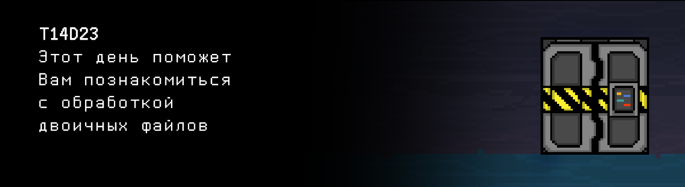

# T14D23

## Quest 1. Back to sort.

***== Получен Quest 1. Создать программу src/state_sort.c, которая сортирует записи в бинарном файле datasets/door_state_1 по возрастанию их даты и времени. Сам файл состоит из массива структур с целочисленными полями: год, месяц, день, час, минута, секунда, статус (0/1), код. Программа должна принимать путь к файлу. Также должно быть реализовано меню, где пункт 0 - вывод содержимого файла в консоль, пункт 1 - сортировка содержимого файла и вывод на экран, пункт 2 - добавление записи, сортировка и вывод на экран. Выгружать сразу весь файл в память нельзя. Рассмотреть абстракцию, что бинарный файл - массив на диске. Разработать для этой абстракции вспомогательные функции. Eсли входной файл оказался пустым, и после этого в него не добавляются новые записи, или если возникла любая ошибка, выводить n/a. Сборка проекта должна осуществляться при помощи Makefile. Имя стадии - state_sort. Имя исполняемого файла - Quest_1. ==***

| Входные данные | Выходные данные |
| ----- | ----- |
| datasets/door_state_1 0| 2020 9 1 12 0 0 0 153 2020 3 25 19 37 56 1 951 2020 4 3 1 53 26 1 393 ...  1991 6 28 10 50 57 0 732 1924 11 22 2 24 10 1 398 |
| datasets/door_state_1 1| 1920 2 24 7 39 14 0 112 1920 4 26 0 32 33 0 926 1920 7 5 18 8 7 1 216 ...  2020 5 30 16 51 40 1 147 2020 9 1 12 0 0 0 153 |
| datasets/door_state_1 2 2020 12 21 23 54 26 1 768| 1920 2 24 7 39 14 0 112 1920 4 26 0 32 33 0 926 1920 7 5 18 8 7 1 216 ...  2020 5 30 16 51 40 1 147 2020 9 1 12 0 0 0 153 2020 12 21 23 54 26 1 768 |

> Перед отправкой задания, убедитесь, что никакие лишние записи на экране не выводятся. Должен быть только ответ на задачу

## Quest 2. And search.

***== Получен Quest 2. Создать программу src/state_search.c, которая производит поиск в бинарном файле по дате в формате "ДД.ММ.ГГГГ". При запуске, программа должна принимать путь к файлу и поисковую строку с датой. Выгружать весь файл в память нельзя. Вывести первый найденный код в консоль. Если входной файл пустой, запись не найдена или возникла любая ошибка выводить n/a. Сборка проекта должна осуществляться при помощи Makefile. Имя стадии - state_search. Имя исполняемого файла - Quest_2. ==***

| Входные данные | Выходные данные |
| ----- | ----- |
| datasets/door_state_2 01.09.2020 | 153 |

## Quest 3. Clear data.

***== Получен Quest 3. Создать программу src/clear_state.c, которая выполняет удаление данных по конкретному временному промежутку в файле с соответствующим уменьшением его размера. При запуске, программа должна принимать путь к файлу и временной промежуток в формате "ДД.ММ.ГГГГ ДД.ММ.ГГГГ", обе даты включительно. Если входной файл пустой или возникла любая ошибка выводить n/a. Сборка проекта должна осуществляться при помощи Makefile. Имя стадии - clear_state. Имя исполняемого файла - Quest_3. ==***

| Входные данные | Выходные данные |
| ----- | ----- |
| datasets/door_state_3 21.09.1945 18.10.1945 | 1920 2 24 7 39 14 0 112 1920 4 26 0 32 33 0 926 1920 7 5 18 8 7 1 216 ...  2020 5 30 16 51 40 1 147 2020 9 1 12 0 0 0 153 |
